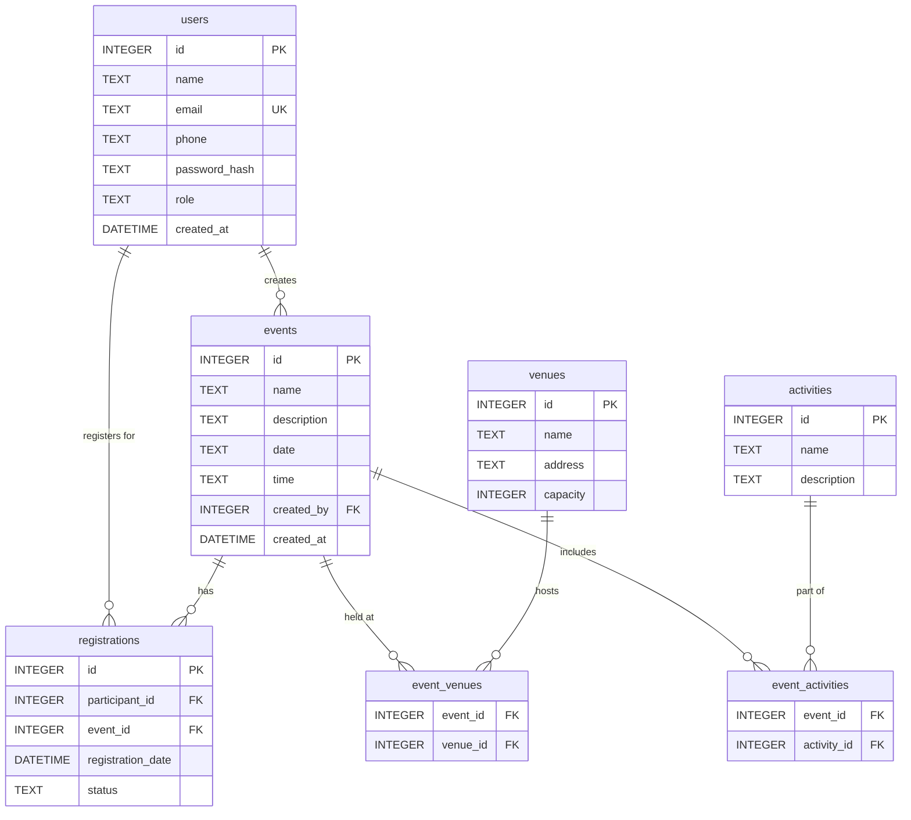
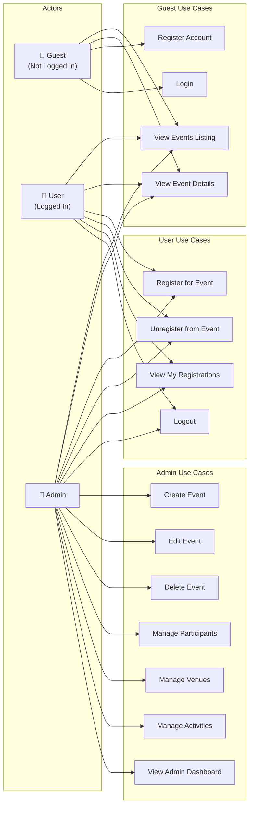
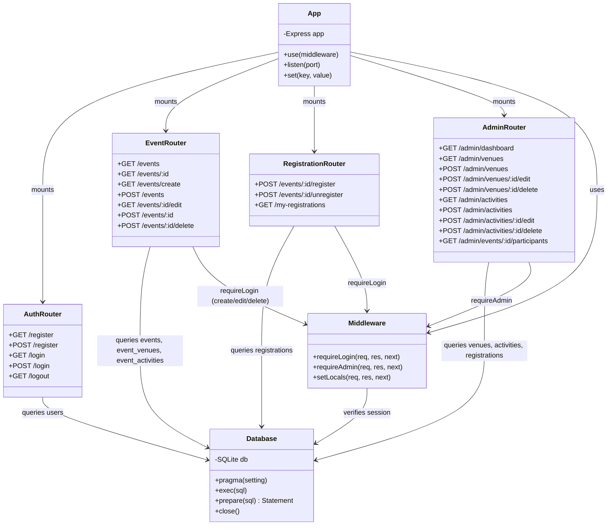
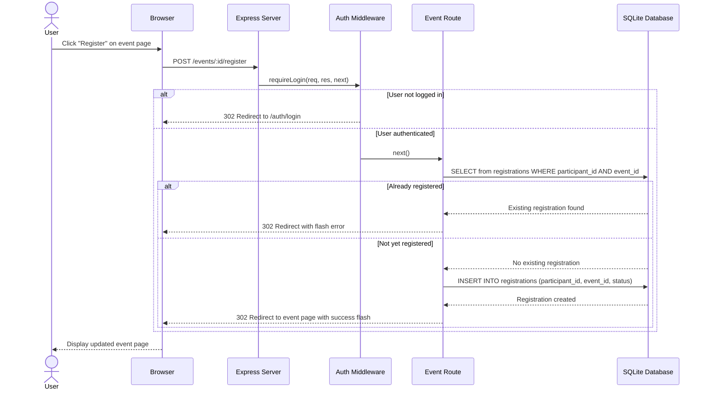
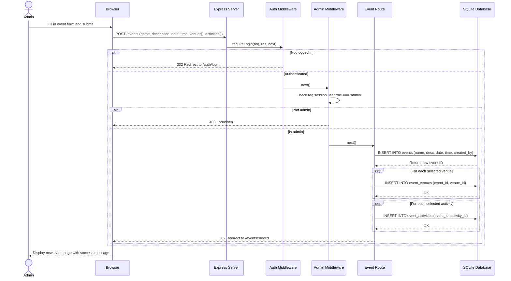
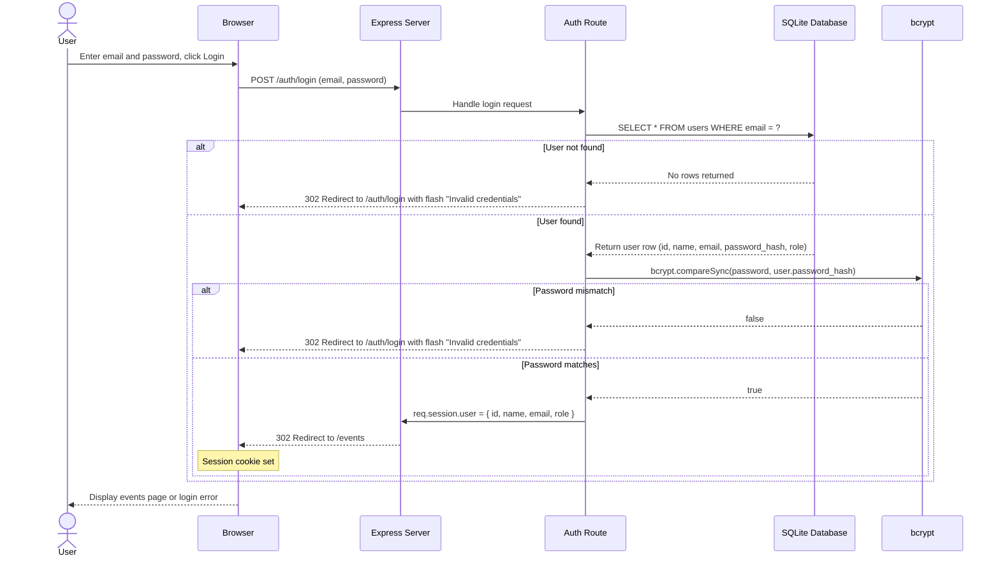

# UML Design & Testing Documentation

**Project:** Community Event Management System  
**Technology Stack:** Node.js / Express / SQLite (better-sqlite3) / EJS  
**Date:** July 2026

---

## Table of Contents

1. [UML Diagrams](#1-uml-diagrams)
   - 1.1 [Entity-Relationship Diagram](#11-entity-relationship-diagram)
   - 1.2 [Use Case Diagram](#12-use-case-diagram)
   - 1.3 [Class Diagram](#13-class-diagram)
   - 1.4 [Sequence Diagrams](#14-sequence-diagrams)
2. [Test Documentation](#2-test-documentation)
   - 2.1 [Test Strategy](#21-test-strategy)
   - 2.2 [Automated Test Plan](#22-automated-test-plan)
   - 2.3 [Manual Test Plan](#23-manual-test-plan)
   - 2.4 [Test Coverage Summary](#24-test-coverage-summary)

---

# 1. UML Diagrams

## 1.1 Entity-Relationship Diagram

The ER diagram below models the full relational schema of the Community Event Management System. It includes seven tables covering users, events, venues, activities, and the junction tables that represent many-to-many relationships.



### Relationship Summary

| Relationship | Type | Description |
|---|---|---|
| users → events | One-to-Many | A user (admin) can create many events |
| users → registrations | One-to-Many | A user can register for many events |
| events → registrations | One-to-Many | An event can have many registrations |
| events ↔ venues | Many-to-Many | An event can use multiple venues; a venue can host multiple events (via `event_venues`) |
| events ↔ activities | Many-to-Many | An event can include multiple activities; an activity can belong to multiple events (via `event_activities`) |

---

## 1.2 Use Case Diagram

Since Mermaid does not natively support UML use case diagrams, the diagram below uses a flowchart to represent actors and their associated use cases.



### Actor Descriptions

| Actor | Description | Permissions |
|---|---|---|
| **Guest** | Unauthenticated visitor | View events, register account, login |
| **User** | Authenticated regular user | All Guest permissions + register/unregister for events, view personal registrations, logout |
| **Admin** | Authenticated administrator | All User permissions + full CRUD on events, venues, activities; participant management; dashboard access |

---

## 1.3 Class Diagram

The class diagram below illustrates the main architectural components of the application, including the database access layer, route handlers, and middleware.



---

## 1.4 Sequence Diagrams

### 1.4.1 User Registration for Event

This diagram shows the flow when a logged-in user registers for a community event.



### 1.4.2 Admin Creating Event

This diagram shows the flow when an admin creates a new event with associated venues and activities.



### 1.4.3 User Login Flow

This diagram shows the complete authentication flow for user login.



---

# 2. Test Documentation

## 2.1 Test Strategy

### Overview

The Community Event Management System employs a multi-layered testing strategy to ensure correctness, security, and usability:

| Layer | Tool | Scope |
|---|---|---|
| **Unit / Integration Tests** | Jest + Supertest | HTTP route handlers, middleware, database operations |
| **Manual Functional Tests** | Browser-based | End-to-end UI workflows, visual verification |
| **Database Tests** | In-memory SQLite | Schema integrity, constraint enforcement |

### Testing Principles

- **Isolation** — Each test runs against a fresh in-memory SQLite database to prevent cross-test contamination.
- **Session Simulation** — Supertest agents maintain cookies across requests to test session-based authentication.
- **Deterministic Data** — A `seedTestData()` helper inserts a predictable dataset before each test.
- **Coverage Areas:**
  - ✅ Authentication (register, login, logout, protected routes)
  - ✅ CRUD Operations (events, venues, activities)
  - ✅ Authorization (admin vs. regular user permissions)
  - ✅ Registration workflows (register, unregister, duplicate prevention)
  - ✅ Edge cases (invalid input, non-existent resources, empty filters)

### Test Files

| File | Description |
|---|---|
| `tests/setup.js` | Shared test harness — in-memory DB, seed data, app bootstrap |
| `tests/auth.test.js` | Authentication flow tests |
| `tests/events.test.js` | Event CRUD and filtering tests |
| `tests/registrations.test.js` | Event registration workflow tests |

---

## 2.2 Automated Test Plan

The table below documents all automated test cases implemented in the Jest test suite.

| Test ID | Test Description | Module | Expected Result | Status |
|---|---|---|---|---|
| AUTH-01 | Register with valid user data | Auth | 302 redirect (account created) | ✅ Implemented |
| AUTH-02 | Register with duplicate email | Auth | Error response (400/409 or redirect with flash) | ✅ Implemented |
| AUTH-03 | Login with valid credentials | Auth | 302 redirect to /events | ✅ Implemented |
| AUTH-04 | Login with wrong password | Auth | Error response (401 or redirect to /login) | ✅ Implemented |
| AUTH-05 | Logout destroys session | Auth | 302 redirect to / or /login | ✅ Implemented |
| AUTH-05b | Access protected route without auth | Auth | 302 redirect to /login | ✅ Implemented |
| EVT-01 | List all events | Events | 200 OK, response contains event names | ✅ Implemented |
| EVT-02 | View event detail page | Events | 200 OK, response contains event info | ✅ Implemented |
| EVT-03 | Access create event page without auth | Events | 302 redirect to login | ✅ Implemented |
| EVT-04 | Admin creates a new event | Events | 201/302 (event created, redirect) | ✅ Implemented |
| EVT-05 | Filter events by date (matching) | Events | 200 OK, matching events shown | ✅ Implemented |
| EVT-05b | Filter events by date (no match) | Events | 200 OK, no matching events | ✅ Implemented |
| EVT-06 | Admin deletes an event | Events | 200/302 (event removed, redirect) | ✅ Implemented |
| REG-01 | User registers for event | Registrations | 200/302 (registration created) | ✅ Implemented |
| REG-02 | Prevent duplicate registration | Registrations | Error (400/409 or redirect with flash) | ✅ Implemented |
| REG-03 | User unregisters from event | Registrations | 200/302 (registration removed) | ✅ Implemented |
| REG-04 | View My Registrations (authenticated) | Registrations | 200 OK | ✅ Implemented |
| REG-05 | View My Registrations (unauthenticated) | Registrations | 302 redirect to login | ✅ Implemented |

### Running Tests

```bash
# Run the full test suite
npm test

# Or directly
npx jest --verbose --forceExit --detectOpenHandles
```

---

## 2.3 Manual Test Plan

The following manual tests are designed to validate the full end-to-end user experience through a browser. These tests should be executed once the application is deployed and running.

| Test ID | Test Case | Steps | Expected Outcome | Actual Outcome | Pass/Fail |
|---|---|---|---|---|---|
| MT-01 | Register new user account | 1. Navigate to /auth/register<br>2. Fill in name, email, phone, password<br>3. Click "Register" | Account is created; user is redirected to login or events page with success message | TBD - To be completed during testing | TBD - To be completed during testing |
| MT-02 | Login with valid credentials | 1. Navigate to /auth/login<br>2. Enter valid email and password<br>3. Click "Login" | User is logged in and redirected to /events; navigation shows user's name | TBD - To be completed during testing | TBD - To be completed during testing |
| MT-03 | Login with invalid credentials (wrong password) | 1. Navigate to /auth/login<br>2. Enter valid email but wrong password<br>3. Click "Login" | Error flash message displayed; user remains on login page | TBD - To be completed during testing | TBD - To be completed during testing |
| MT-04 | Browse events listing page | 1. Navigate to /events<br>2. Observe the page content | All events are displayed in a list/grid with name, date, time, and venue information | TBD - To be completed during testing | TBD - To be completed during testing |
| MT-05 | Filter events by date | 1. Navigate to /events<br>2. Select a date in the filter form<br>3. Submit the filter | Only events matching the selected date are displayed | TBD - To be completed during testing | TBD - To be completed during testing |
| MT-06 | Filter events by venue | 1. Navigate to /events<br>2. Select a venue from the dropdown filter<br>3. Submit the filter | Only events at the selected venue are displayed | TBD - To be completed during testing | TBD - To be completed during testing |
| MT-07 | View event detail page | 1. Navigate to /events<br>2. Click on an event name/card<br>3. Observe the detail page | Event details shown including name, description, date, time, venue(s), activity(ies), and registration button | TBD - To be completed during testing | TBD - To be completed during testing |
| MT-08 | Register for an event | 1. Login as a regular user<br>2. Navigate to an event detail page<br>3. Click "Register for Event" | Registration is confirmed; success message shown; registration appears in My Registrations | TBD - To be completed during testing | TBD - To be completed during testing |
| MT-09 | View My Registrations page | 1. Login as a regular user<br>2. Navigate to /my-registrations | All user's current registrations are listed with event name, date, and status | TBD - To be completed during testing | TBD - To be completed during testing |
| MT-10 | Unregister from an event | 1. Login as a regular user<br>2. Navigate to /my-registrations or event detail<br>3. Click "Unregister" or "Cancel Registration" | Registration is removed; success message shown; event no longer appears in My Registrations | TBD - To be completed during testing | TBD - To be completed during testing |
| MT-11 | Admin create new event with venues and activities | 1. Login as admin<br>2. Navigate to /events/create<br>3. Fill in event details, select venue(s) and activity(ies)<br>4. Submit the form | Event is created with associated venues and activities; redirected to event detail page | TBD - To be completed during testing | TBD - To be completed during testing |
| MT-12 | Admin edit existing event | 1. Login as admin<br>2. Navigate to an event detail page<br>3. Click "Edit"<br>4. Modify fields and submit | Event is updated with new values; changes reflected on detail page | TBD - To be completed during testing | TBD - To be completed during testing |
| MT-13 | Admin delete event | 1. Login as admin<br>2. Navigate to an event detail page<br>3. Click "Delete"<br>4. Confirm deletion | Event is removed from the system; redirected to events listing; event no longer appears | TBD - To be completed during testing | TBD - To be completed during testing |
| MT-14 | Admin manage venues (add, edit, delete) | 1. Login as admin<br>2. Navigate to /admin/venues<br>3. Add a new venue with name, address, capacity<br>4. Edit an existing venue<br>5. Delete a venue | Venue is created, updated, and deleted successfully; changes reflected in venue list and event forms | TBD - To be completed during testing | TBD - To be completed during testing |
| MT-15 | Admin manage activities (add, edit, delete) | 1. Login as admin<br>2. Navigate to /admin/activities<br>3. Add a new activity with name and description<br>4. Edit an existing activity<br>5. Delete an activity | Activity is created, updated, and deleted successfully; changes reflected in activity list and event forms | TBD - To be completed during testing | TBD - To be completed during testing |
| MT-16 | Non-admin user cannot access admin pages | 1. Login as a regular user (role: 'user')<br>2. Attempt to navigate to /admin/dashboard, /admin/venues, /admin/activities<br>3. Attempt to POST to admin-only routes | Access is denied (403 or redirect to /events); admin pages and operations are inaccessible | TBD - To be completed during testing | TBD - To be completed during testing |

---

## 2.4 Test Coverage Summary

### Areas Covered

| Area | Automated | Manual | Notes |
|---|---|---|---|
| User Registration | ✅ | ✅ | Valid and duplicate-email scenarios |
| User Login | ✅ | ✅ | Valid credentials, wrong password |
| User Logout | ✅ | — | Session destruction verified |
| Protected Routes | ✅ | ✅ | Redirect to login when unauthenticated |
| Event Listing | ✅ | ✅ | Basic listing with event data |
| Event Detail | ✅ | ✅ | Individual event page |
| Event Creation (Admin) | ✅ | ✅ | With venue and activity associations |
| Event Editing (Admin) | — | ✅ | Manual test only |
| Event Deletion (Admin) | ✅ | ✅ | Cascade deletion of associations |
| Event Filtering | ✅ | ✅ | By date; manual also by venue |
| Event Registration | ✅ | ✅ | Register and duplicate prevention |
| Event Unregistration | ✅ | ✅ | Remove registration |
| My Registrations | ✅ | ✅ | Authenticated and unauthenticated access |
| Venue Management | — | ✅ | Admin CRUD via browser |
| Activity Management | — | ✅ | Admin CRUD via browser |
| Admin Authorization | — | ✅ | Non-admin denied access |

### Known Limitations

1. **No Visual/CSS Testing** — Automated tests do not verify visual layout or styling. UI correctness is validated only through manual testing.
2. **No Load/Stress Testing** — The current suite does not test performance under high concurrency. This is acceptable for a university project scope.
3. **Event Editing** — Automated test for editing events is not implemented; covered by manual testing (MT-12).
4. **Venue/Activity CRUD** — Automated tests for admin venue and activity management are not included; these are fully covered by manual tests (MT-14, MT-15).
5. **Flash Messages** — Tests verify HTTP status codes and redirects but do not assert on flash message content rendered in EJS templates.

### Running the Test Suite

```bash
# Install dependencies (if not done)
npm install

# Run all automated tests
npm test

# Generate coverage report (optional)
npx jest --coverage --forceExit --detectOpenHandles
```

---

*Document prepared for COMP/IT coursework — Community Event Management System.*
